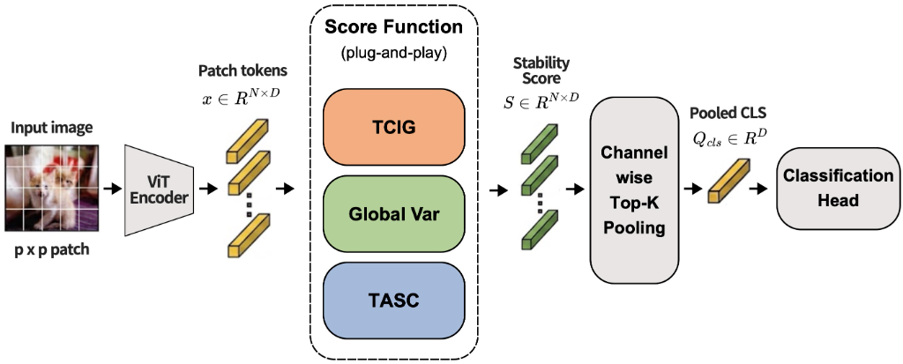

# LazyStrike

Official research implementation for **Beyond FFT: Frequency vs. Variance vs. Sparsity**.

**[Read the paper (PDF)](paper/Beyond%20FFT%20-%20Frequency%20vs.%20Variance%20vs.%20Sparsity.pdf)** · [LaTeX source](paper/main.tex) · [Code specification](docs/CODE_SPEC.md) · [Release guide](docs/RELEASING.md)



## Research overview

Large pre-trained Vision Transformers can assign abnormally large feature norms to uninformative background patches. LaSt-ViT addresses this lazy-aggregation behavior with an FFT-based stability score, motivated by the premise that foreground patches have low channel-wise variance.

LazyStrike asks a more basic question: **does the FFT measure the property named by that premise?** A ViT channel axis has no inherent order, but an FFT is ordering-dependent. We therefore compare frequency, variance, and sparsity hypotheses while keeping the ViT backbone and channel-wise top-K aggregation fixed.

- **FFT** measures an ordering-dependent frequency structure.
- **TCIG** replaces the FFT with local channel smoothing.
- **Global / Local Variance** directly measure channel-wise deviation.
- **TASC** detects activation spikiness with an L1/L2-derived clipping threshold.

On ImageNet-100 with ViT-S/16 and `K=7`, classification accuracy remains similar across methods, while foreground localization separates them sharply:

| Method | raw_score PiB | vote_count PiB | pooled PiB | Top-1 |
|---|---:|---:|---:|---:|
| FFT (baseline) | 28.42 | 22.74 | 38.17 | 92.30 |
| TCIG | 29.47 | 22.04 | 18.45 | **92.34** |
| Global Variance | 9.40 | 13.57 | **67.29** | **92.34** |
| **TASC** | **65.31** | **57.19** | 62.53 | 92.16 |

TASC reaches 65.31% raw-score PiB, about 2.3x the FFT baseline. Global Variance and TASC are both permutation invariant, yet differ by about 4.2x in vote-count PiB. The result indicates that permutation invariance is not sufficient: directly measuring sparse channel spikes matters more than measuring variance alone.

## Installation

The reference environment uses Python 3.10, PyTorch 2.1, torchvision 0.16, and CUDA 11.8.

```bash
conda env create -f environment.yml
conda activate lazy-strike
pip install -e .
```

Run the unit and smoke checks before training:

```bash
pytest tests/ -x -v
python scripts/smoke_verify.py
```

## Data preparation

The repository defaults to portable relative paths:

```text
data/imagenet/raw             raw ImageNet archives
data/imagenet/full            prepared ImageNet-1K
data/imagenet-100             ImageNet-100 subset
data/imagenet100_classes.txt  one ImageNet wnid per line
artifacts/checkpoints         training checkpoints
artifacts/eval                evaluation outputs
artifacts/viz                 visualizations
```

Prepare ImageNet-1K from legally obtained archives, then build the ImageNet-100 subset:

```bash
python scripts/prepare_imagenet.py \
  --raw-root data/imagenet/raw \
  --out-root data/imagenet/full

python scripts/build_imagenet100.py \
  --imagenet-root data/imagenet/full \
  --out-root data/imagenet-100 \
  --classes-txt data/imagenet100_classes.txt
```

ImageNet itself is not redistributed by this repository. Paths can be changed with command-line OmegaConf overrides, so no source edit is required for another machine.

## Training

Single process:

```bash
python scripts/train.py \
  --config configs/cell/tasc.yaml \
  data.root=/path/to/imagenet-100 \
  paths.checkpoint_root=/path/to/checkpoints \
  logging.use_wandb=false
```

Four-GPU DDP:

```bash
CUDA_VISIBLE_DEVICES=0,1,2,3 torchrun --standalone --nproc_per_node=4 \
  scripts/train.py \
  --config configs/cell/tasc.yaml \
  data.batch_size_per_gpu=256
```

The main paper cells are:

```text
configs/cell/fft.yaml
configs/cell/tcig.yaml
configs/cell/global_var.yaml
configs/cell/tasc.yaml
configs/cell/local_var.yaml
configs/cell/_vanilla.yaml
```

`scripts/launch_experiments.sh` runs the configured experiment tiers. Override `DATA_ROOT`, `IMAGENET_FULL`, `CKPT_ROOT`, `PIB_OUT`, `NGPU`, or `CUDA_VISIBLE_DEVICES` when needed.

## Evaluation

Classification:

```bash
python scripts/eval_classification.py \
  --ckpt artifacts/checkpoints/100ep/E1_tasc/best.pth
```

Point-in-Box localization:

```bash
python scripts/eval_pib.py \
  --ckpt artifacts/checkpoints/100ep/E1_tasc/best.pth \
  --imagenet-root data/imagenet/full \
  --classes-txt data/imagenet100_classes.txt \
  --score-methods raw_score vote_count patch_score_mean \
  --output-json artifacts/eval/pib/E1_tasc.json
```

Channel permutation test:

```bash
python scripts/eval_permutation.py \
  --ckpt artifacts/checkpoints/100ep/E1_tasc/best.pth \
  --num-perms 5 \
  --protocol score_only
```

Patch-score visualization:

```bash
python scripts/visualize_patch_score.py \
  --ckpt tasc=artifacts/checkpoints/100ep/E1_tasc/best.pth \
  --images /path/to/images \
  --out-dir artifacts/viz
```

## Paper

The repository includes both the release PDF and its complete XeLaTeX source. All three authors are marked as equal contributors. The first-page postal address and separate representative-email line from the original HWP layout are intentionally omitted.

Build from `paper/` with:

```bash
latexmk -xelatex -interaction=nonstopmode -halt-on-error main.tex
```

See [paper/README.md](paper/README.md) for font and build details.

## Repository layout

```text
configs/             experiment and ablation configurations
lazystrike/data/     ImageNet and PiB datasets, transforms
lazystrike/eval/     classification, PiB, permutation, visualization logic
lazystrike/models/   stability scores, aggregators, ViT integration
lazystrike/train/    optimizer, scheduler, trainer
scripts/             preparation, training, evaluation entry points
tests/               unit and integration tests
docs/CODE_SPEC.md    tensor contracts and module-level specification
paper/               LaTeX source, figures, and release PDF
```

## Citation

```bibtex
@misc{lee2026beyondfft,
  title   = {Beyond FFT: Frequency vs. Variance vs. Sparsity},
  author  = {Tae Joo Lee and Jang Ho Park and Yeseo Park},
  year    = {2026},
  note    = {All authors contributed equally},
  url     = {https://github.com/parkyeseo/LazyStrike}
}
```

Machine-readable citation metadata is available in [CITATION.cff](CITATION.cff).

## Release status

This tree is prepared as the paper-aligned `v1.0.0` research artifact. Create the immutable Git tag only after CI passes and the PDF has been visually reviewed. A source-code license has not been inferred or added; the authors should choose and add one before broad third-party reuse.
